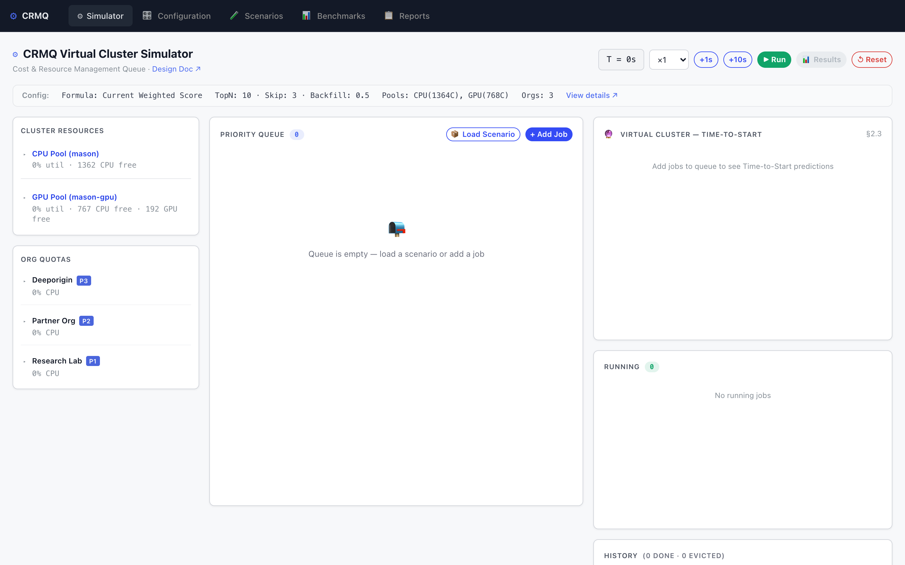
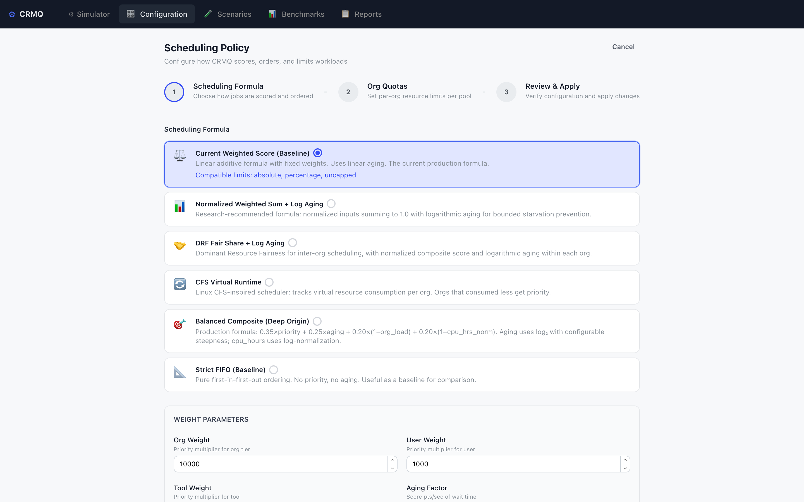
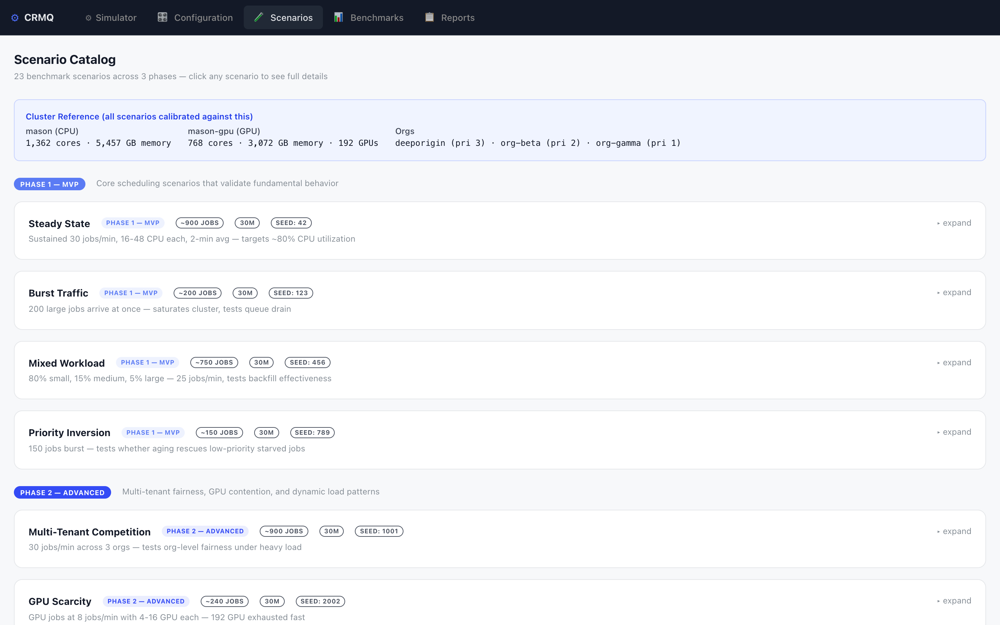
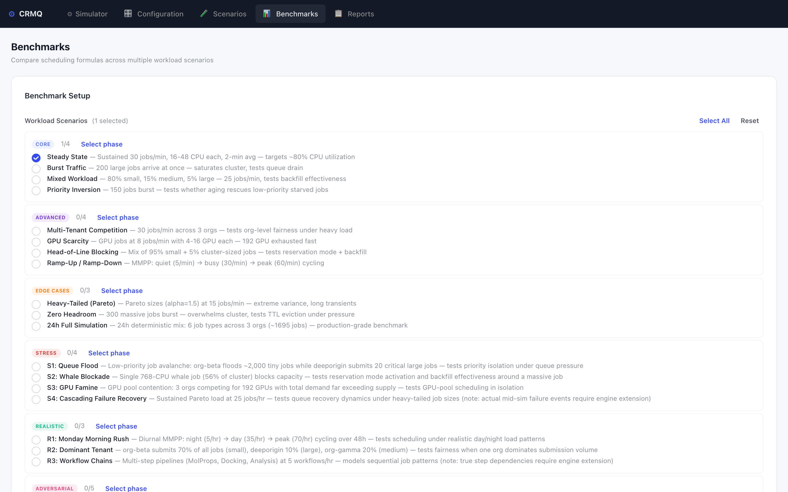

# CRMQ Virtual Cluster Simulator

An interactive browser-based simulator for the **Cost & Resource Management Queue (CRMQ)** priority scheduling system. It models how a multi-tenant cluster scheduler prioritizes and dispatches computational jobs based on organizational priorities, user priorities, tool priorities, fair-share algorithms, and aging mechanisms.

Everything runs client-side — no backend required. State persists to localStorage.

**Live demo:** [deeporiginbio.github.io/platform-crmq-simulator](https://deeporiginbio.github.io/platform-crmq-simulator/)

---

## Simulator

The main interface provides a real-time interactive simulation of the CRMQ scheduling engine with six panels:

- **Cluster Resources** — Live utilization bars per pool (CPU and GPU), showing reserved, in-use, and free capacity for CPU cores, memory, and GPUs
- **Org Quotas** — Per-organization resource consumption against configured quota limits
- **Priority Queue** — Ranked job queue with detailed scoring breakdown per formula, showing org/user/tool priority factors, aging bonus, and composite score
- **Virtual Cluster Predictions** — Time-to-start estimates for every queued job, with blocking reason (CPU capacity, GPU capacity, org quota, reservation mode, etc.) and confidence window
- **Running Jobs** — Currently active jobs with progress bars, remaining duration, and resource allocation
- **History** — Completed and evicted job counts

Controls include play/pause, adjustable speed (1x-60x), manual step (+1s, +10s), scenario loading, and manual job submission.



---

## Configuration

A three-step wizard to configure scheduling policies:

**Step 1 — Scheduling Formula:** Choose from five scoring strategies that determine how jobs are ranked in the queue:
- **Current Weighted Score** — Linear weighted sum with configurable org/user/tool weights and aging factor. The current production formula.
- **Normalized Weighted Sum + Log Aging** — Normalized factors capped at 1.0 with logarithmic aging for bounded score ranges.
- **DRF Fair Share + Log Aging** — Dominant Resource Fairness based on actual org resource consumption, favoring orgs that have consumed less.
- **Balanced Composite (Deep Origin)** — Multi-factor formula combining priority, aging, org load, and CPU-hour factors with configurable weights.
- **Strict FIFO** — Pure arrival-time ordering. No priority, no aging. Useful as a baseline for comparison.

**Step 2 — Org Quotas:** Set per-organization resource limits for each pool. Supports uncapped, absolute (fixed CPU/memory/GPU caps), and percentage-based quotas.

**Step 3 — Review & Apply:** Validates configuration and shows any blocking issues before applying.



---

## Scenarios

A catalog of 23 benchmark scenarios organized into 6 phases of increasing complexity:

| Phase | Focus | Examples |
|-------|-------|---------|
| **Core** | Fundamental scheduling validation | Steady State (80% utilization), Burst Traffic (6x oversubscription), Mixed Workload, Priority Inversion |
| **Advanced** | Multi-tenant fairness + GPU contention | Multi-Tenant Competition, GPU Scarcity, Head-of-Line Blocking |
| **Edge Cases** | Extreme distributions | Heavy-Tailed (Pareto), Zero Headroom, 24h Full Simulation |
| **Stress** | High-intensity load | Queue Flood (2,880 jobs/batch), Whale Blockade (768-CPU job), GPU Famine, Cascading Failure Recovery |
| **Realistic** | Production-like patterns | Monday Morning Rush (MMPP daily cycles), Dominant Tenant, Workflow Chains |
| **Adversarial** | Game theory / exploitation | Job Splitting Attack, Priority Inversion Stress, Starvation Gauntlet, Oscillating Demand |

Each scenario defines arrival patterns (Poisson, Burst, Uniform, MMPP), job size distributions, per-org submission rates, and expected duration. Expandable details explain calibration rationale and what each scenario tests.



---

## Benchmarks

Batch comparison tool for evaluating scheduling formulas across multiple workload scenarios:

- Select any combination of scenarios and formulas to compare
- Configure replication count (1-200; minimum 30 recommended for statistical significance via CLT)
- Runs a discrete event simulation (DES) engine in a Web Worker to keep the UI responsive
- Generates per-formula metrics: wait times, throughput, fairness (Jain's index), utilization
- Produces confidence intervals, paired t-tests, and cross-scenario comparison charts
- Results auto-saved as reports with export to PDF, Markdown, JSON, and CSV



---

## How Scheduling Works

### Priority Scoring
Each formula produces a single score per job. Jobs are ranked by score (highest first), and the top-N candidates are evaluated for dispatch each tick.

### Two-Gate Admission
1. **Gate 1 — Org Quota:** Does the org have room within its per-pool quota? If not, the job is skipped and its skip count increments.
2. **Gate 2 — Pool Capacity:** Does the pool have enough free CPU, memory, and GPUs? If not, the job is skipped.

### Reservation Mode
When a high-priority job is skipped more than `skipThreshold` times, reservation mode activates. The scheduler blocks new dispatches for other jobs and accumulates resources until the target job can fit. Backfilling is still allowed for smaller jobs whose duration is within `backfillMaxRatio` of the blocked job.

### Virtual Cluster Predictions
An event-driven fast-forward simulation clones the current state and runs the scheduler forward up to 500 iterations to estimate when each queued job will start. Predictions include a confidence window (5-50%) that widens with queue depth, estimated wait time, and active job count.

---

## Tech Stack

- [Next.js](https://nextjs.org/) 14 (static export)
- [React](https://react.dev/) 18
- [Mantine](https://mantine.dev/) 8 (UI components)
- [Zustand](https://zustand.docs.pmnd.rs/) (state management)
- [Plotly.js](https://plotly.com/javascript/) (benchmark charts)
- [Zod](https://zod.dev/) (schema validation)
- TypeScript

## Getting Started

```bash
cd crmq-simulator
npm install
npm run dev
```

Open [http://localhost:3000](http://localhost:3000).

## Build

```bash
npm run build
```

Static output is generated in `crmq-simulator/out/`, ready for deployment to any static host.

## Deployment

The project deploys automatically to GitHub Pages on push to `main` via the included workflow.

Live at: https://deeporiginbio.github.io/platform-crmq-simulator/
